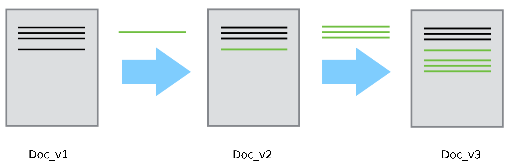
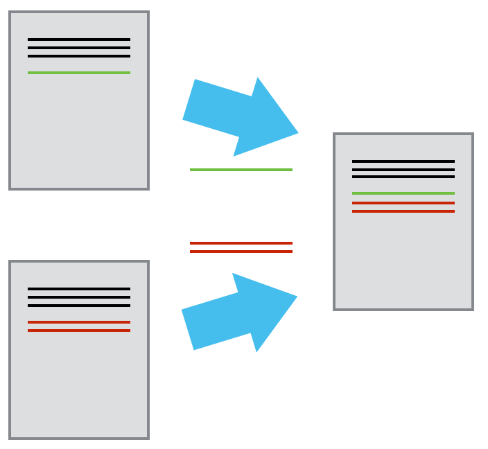

---
output:
  beamer_presentation:
    #keep_tex: true
    fig_caption: false
    includes:
      in_header: prestemplate.sty
---

```{r include = FALSE, eval = FALSE, echo = FALSE}
library(knitr)
library(rmarkdown)
rmarkdown::render("git_initiation.Rmd")
```
#


#


#


#


#


#


#


#
Images from Software Carpentry lessons:

Daisie Huang and Ivan Gonzalez (eds): "Software Carpentry: Version Control with Git."
Version 2016.06, June 2016, https://github.com/swcarpentry/git-novice, 10.5281/zenodo.57467.
